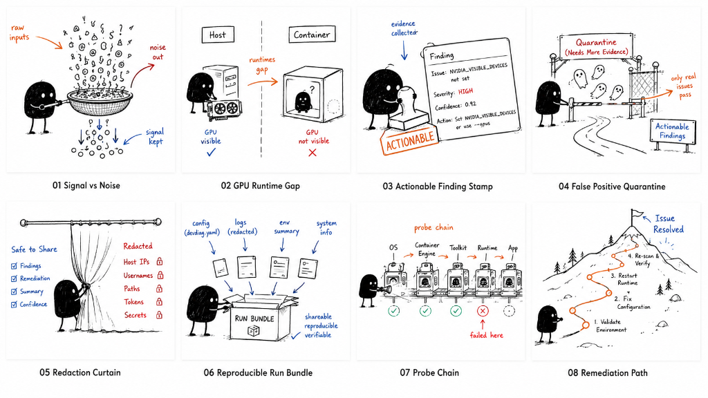
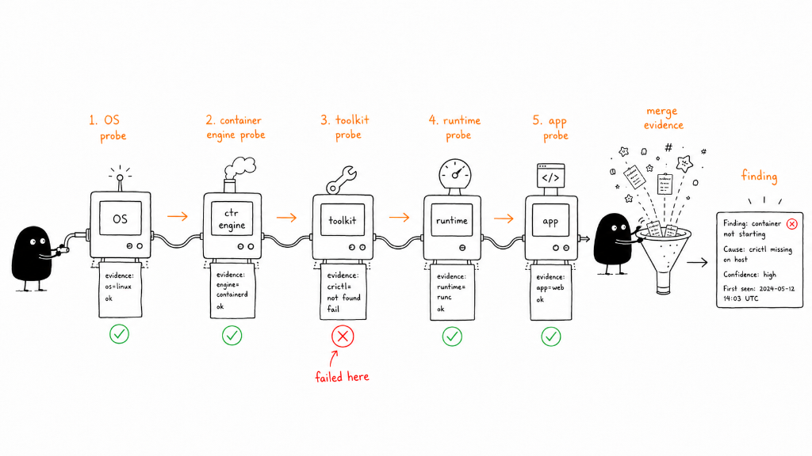
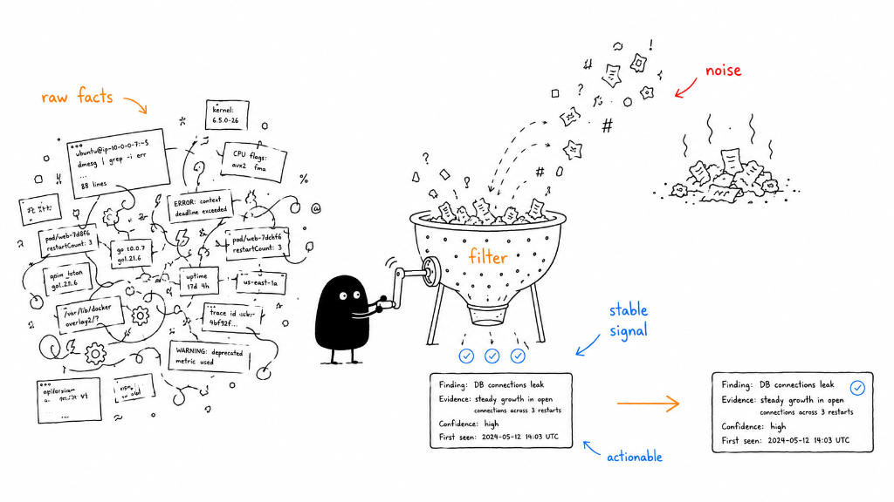
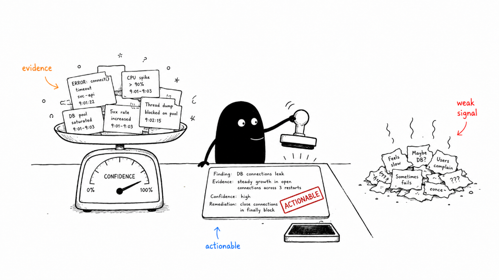
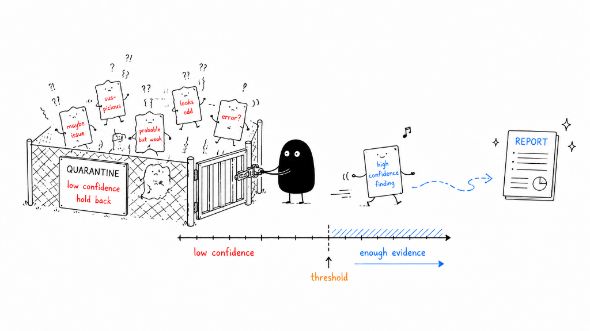
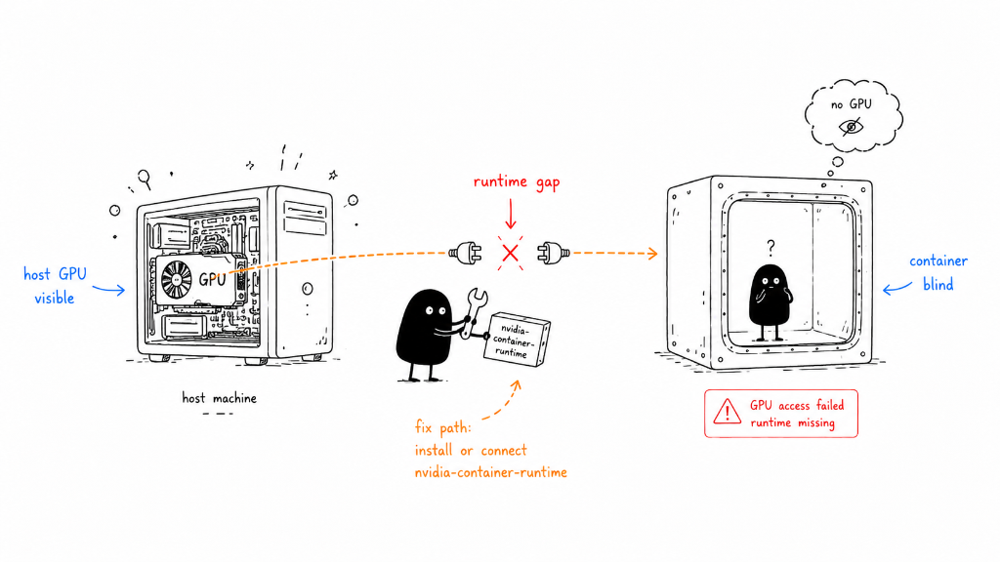
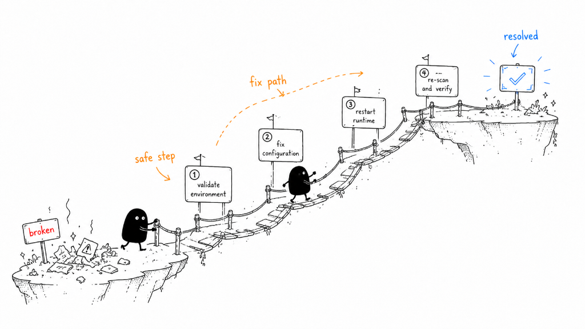
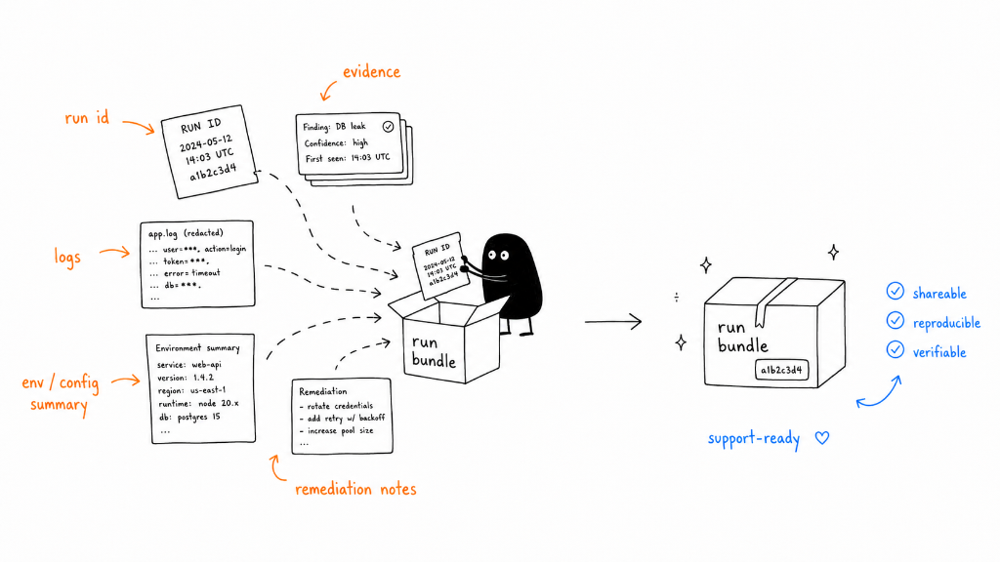
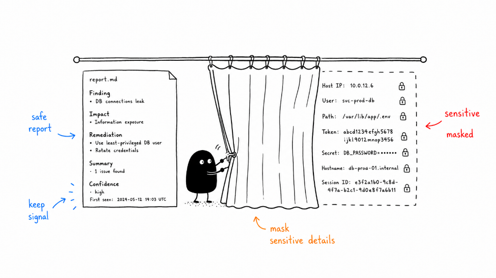

# DevDiag

DevDiag is a Linux-first, evidence-driven diagnostic CLI for developers. It correlates repo metadata, host state, containers, services, logs, CI config, caches, GPU signals, and optional traces to explain why a project does not run correctly on the current Linux machine.



## Core Promise

Run one command in a repo and get ranked, evidence-backed findings with safe next steps:

```bash
devdiag scan .
```

For an interactive exploration of findings and evidence:

```bash
devdiag inspect .
```

DevDiag is built for problems such as:

- works-on-my-machine environment drift
- Docker Compose and Dev Containers mismatch
- Podman/rootless container drift
- missing `.env` keys and Compose interpolation issues
- runtime version mismatch for Node, Python, Go, .NET, Rust, and ML stacks
- port conflicts, DNS/proxy drift, and service readiness failures
- systemd, filesystem permission, UID/GID, SELinux, and AppArmor issues
- Git guardrails for tracked env files and unsafe local state
- GitHub Actions local parity, `act`/local CI drift, and devcontainer-vs-CI mismatch
- CUDA, NVIDIA, PyTorch, TensorFlow, JAX, and container GPU diagnostics
- package/build cache ownership and stale-cache evidence
- safe fix planning, redacted support capsules, and trace-based evidence

## Command Philosophy

```text
scan    -> produce reports (automation, scripts, CI)
inspect -> interactively explore findings and evidence (read-only TUI)
check   -> targeted domain checks with verbose evidence
fix     -> deliberate dry-run and apply workflow outside the TUI
```

- `scan` is the primary automation path. It writes nothing unless `--save-report` is passed.
- `inspect` is an optional interactive workflow. It consumes the same `app.Scan` events and `schema.Report` as the CLI, but never shells out to `devdiag scan`.
- `check` is for deep domain investigation (containers, CI, GPU, security, etc.).
- `fix` is separate and explicit. There is no fix-apply path inside the TUI.

Plain `devdiag` shows normal Cobra help and does not auto-open the TUI.

## How It Works: The Diagnostic Engine

To produce reliable results with zero system disruption, DevDiag operates on a structured diagnostic pipeline:

### 1. The Probe Chain (Sequential Diagnostics)



DevDiag executes diagnostic probes sequentially down the software stack for the target project:
1. **OS Probe**: Validates kernel, OS version, resource limits, and system variables.
2. **Container Engine Probe**: Checks engine availability (Docker, Podman) and socket health.
3. **Toolkit Probe**: Verifies developer tools and command-line utilities (e.g., `crictl`, `git`).
4. **Runtime Probe**: Confirms runtime environments (e.g., Node.js, Python, Go, CUDA).
5. **App Probe**: Analyzes application configuration, dependencies, and port availability.

If any probe in the chain fails (e.g., `crictl` is missing in the Toolkit stage), DevDiag halts downstream probes, pinpoints the failure, merges the gathered evidence, and generates a detailed diagnostic finding.

**How to Use**:
- Run targeted checks using domain commands:
  ```bash
  devdiag check env .
  devdiag check containers .
  ```

---

### 2. Signal vs. Noise (Fact Filtering)



A diagnostic scan encounters a massive volume of "raw facts" (system logs, metrics, config keys, kernel messages). DevDiag passes this data through a smart filter funnel, separating irrelevant background warnings and normal messages (Noise) from stable signals that indicate real problems.

**How to Use**:
- Manage noise and ignore patterns in your project's `devdiag.yaml` config file:
  ```yaml
  noise:
    ignore_paths:
      - "venv/**"
    suppress_findings:
      - id: F-CI-SHELL-001
        reason: "ignored local drift"
  ```
- To view hidden or low-severity findings, use the `--include-hidden` flag:
  ```bash
  devdiag scan . --include-hidden
  ```

---

### 3. Actionable Findings (Confidence Grading)



Findings are not just simple keyword alerts. DevDiag weighs all gathered evidence (such as connection timeouts, CPU spikes, and pool saturation logs) on a scale to calculate a confidence score. If the evidence is strong enough, the finding is stamped as **Actionable** and returned to the developer with remediation suggestions. Speculative or weak signals are discarded.

**How to Use**:
- Use finding confidence to control automated build failures:
  ```bash
  devdiag scan . --fail-severity high
  ```
- Explore findings interactively (read-only) with:
  ```bash
  devdiag inspect .
  ```

---

### 4. False Positive Quarantine



Speculative warnings ("looks odd", "maybe issue", "suspicious") that do not meet the confidence threshold are held back in a quarantine gate. This prevents false positives from cluttering reports or failing automated workflows, ensuring that only verified, actionable issues reach the developer.

**How to Use**:
- Configure custom severity thresholds in `devdiag.yaml`:
  ```yaml
  policy:
    fail_severity: high
  ```
- Inspect active rules and their severities:
  ```bash
  devdiag rules list
  ```

---

## Diagnosing GPU Runtime Gaps



One of the most complex works-on-my-machine problems is container GPU access. Even if a host machine has a fully functioning, visible physical GPU, a container can remain completely "blind" to it. This happens due to a "runtime gap"—usually a missing or unconfigured container runtime integration (like the `nvidia-container-runtime` plugin).

DevDiag bridges this gap by scanning the host driver layer, verifying container engine config, and testing GPU visibility inside the runtime context.

**How to Use**:
- Run GPU container diagnostics:
  ```bash
  devdiag check containers --gpu
  devdiag check gpu --python
  ```
- DevDiag identifies the runtime gap and provides the exact install/connection command path to restore container GPU visibility.

---

## Guided Remediation Path



Resolving diagnostic issues is a structured, step-by-step path designed to prevent system mutation until the fix is verified:
1. **Validate Environment**: Collect evidence and verify initial state.
2. **Fix Configuration**: Apply templates or update configs via dry-run proposals.
3. **Restart Runtime**: Restart container engines, services, or runtimes to load changes.
4. **Re-scan & Verify**: Run `devdiag scan` to confirm the issue is fully resolved.

**How to Use**:
- List available fixes for your current run:
  ```bash
  devdiag fix --list
  ```
- Interactively explore and safely preview configuration changes (dry-run):
  ```bash
  devdiag fix --templates
  ```

## Build

```bash
/usr/local/go/bin/go build -o devdiag ./cmd/devdiag
```

The module targets Go 1.25 as the minimum supported baseline. CI also gates Go
1.26 compatibility before release.

## Install

Install the latest stable release:

```bash
curl -fsSL -o install.sh https://raw.githubusercontent.com/meedoomostafa/devdiag/main/scripts/install.sh
bash install.sh
```

Install a specific release:

```bash
curl -fsSL -o install.sh https://raw.githubusercontent.com/meedoomostafa/devdiag/main/scripts/install.sh
DEVDIAG_INSTALL_VERSION=v0.2.7 bash install.sh
```

The installer supports Linux distributions with Bash, `tar`, `curl` or `wget`,
and Go 1.25 or newer. It installs to `/usr/local/bin` when writable and falls
back to `~/.local/bin` otherwise.

Useful installer options:

```bash
# Install to a user-local directory and configure PATH automatically.
curl -fsSL -o install.sh https://raw.githubusercontent.com/meedoomostafa/devdiag/main/scripts/install.sh
bash install.sh --bin-dir "$HOME/.local/bin" --add-to-path

# Preview the resolved release tag, archive URL, and local paths without mutating files.
curl -fsSL -o install.sh https://raw.githubusercontent.com/meedoomostafa/devdiag/main/scripts/install.sh
bash install.sh --dry-run

# Print manual PATH addition command instead of modifying profiles.
bash install.sh --print-path-command
```

For private repository installs, pass an authenticated GitHub token so the
installer can fetch the source archive:

```bash
curl -fsSL -H "Authorization: Bearer $GITHUB_TOKEN" -o install.sh \
  https://raw.githubusercontent.com/meedoomostafa/devdiag/main/scripts/install.sh
GITHUB_TOKEN="$GITHUB_TOKEN" bash install.sh
```

### Self-Contained Clarification

The installed DevDiag binary is a single Go binary built with CGO disabled.
The installer itself requires Bash, tar, mktemp, Go 1.25+, and curl or wget.
DevDiag may optionally call system tools such as Docker, Podman, kubectl,
strace, systemctl, git, nvidia-smi, and language runtimes depending on the
checks requested.

## Update

To update DevDiag, run the updater. It resolves the latest GitHub Release,
downloads that release's installer, builds a fresh binary from the source
archive, and atomically replaces the previous binary. It does not download
binary diffs.

```bash
devdiag update
```

To preview the update plan without mutating anything:

```bash
devdiag update --dry-run
```

For manual PATH configuration:

```bash
export PATH="$HOME/.local/bin:$PATH"
```

Fish:

```fish
fish_add_path "$HOME/.local/bin"
```

## Common Commands

```bash
devdiag doctor self
devdiag scan . --format human
devdiag scan . --format json
devdiag scan . --format ndjson
devdiag scan . --ci
devdiag scan . --verbose
devdiag scan . --include-hidden
devdiag scan . --save-report
devdiag inspect .
devdiag tui .                       # alias for inspect
devdiag check env . --verbose
devdiag check runtimes . --verbose
devdiag check containers . --verbose
devdiag check containers --gpu
devdiag check security . --verbose
devdiag check ci .
devdiag check gpu --python
devdiag check cache .
devdiag repro -- npm test
devdiag repro --format ndjson -- npm test
devdiag trace --scope file,process,network -- npm test
devdiag trace --backend ebpf --scope file,process,network -- npm test
devdiag fix --templates
devdiag fix --list
devdiag capsule create
devdiag capsule inspect support-run.devdiag.tgz --format json
devdiag rules list --format json
devdiag rules packs --format json
devdiag rules validate team-rules.yaml --format json
devdiag issue template --run-id <run-id> --format markdown
```

`devdiag scan` is non-mutating by default. Commands that load saved reports,
such as `devdiag fix --list`, require a prior `devdiag scan --save-report`.

## Project Config

DevDiag prefers a shareable `devdiag.yaml` file for team baselines and policy
settings. Legacy `.devdiag.yml` and `.devdiag.yaml` files are still read for
compatibility. The `.devdiag/` directory remains reserved for local run
artifacts and should not be used as the shareable team config.

```yaml
policy:
  fail_severity: high
ci:
  env:
    ignore_missing_local:
      - CI_ONLY_SECRET
    ignore_missing_ci:
      - LOCAL_ONLY_DEVELOPMENT_KEY
noise:
  ignore_paths:
    - ".venv/**"
    - "venv/**"
    - "**/site-packages/**"
  suppress_findings:
    - id: F-CI-SHELL-001
      reason: "local shell intentionally differs from CI"
```

`ignore_missing_local` suppresses `F-CI-ENV-001` for CI variables that should
not appear in local env files. `ignore_missing_ci` suppresses `F-CI-ENV-002` for
local-only variables that should not appear in CI.

`policy.fail_severity` sets the default findings exit-code threshold for
`scan` and `check` commands when `--fail-severity` is not passed. Explicit CLI
flags always win, and invalid config values are reported as partial collector
results.

By default, `scan` and `inspect` keep the screen focused on actionable medium,
high, and critical findings. Low-severity, informational, evidence-only, and
configured suppressed findings are hidden from rendered and saved reports unless
`--include-hidden` is passed. `noise.ignore_paths` keeps generated or dependency
trees from becoming project-level evidence, and `noise.suppress_findings` hides
known project-specific noise.

Team rule-pack metadata can be inspected locally before it is shared:

```bash
devdiag config validate devdiag.yaml --format json
devdiag rules packs --format json
devdiag rules validate team-rules.yaml --format json
devdiag scan . --rule-pack team-rules.yaml --format json
```

Rule packs default to `engine: go` for built-in metadata. External
`engine: rego` packs must declare `entrypoint` and `policy_files`; policies
receive the normalized scan snapshot and may only return finding candidates.

Saved runs can generate issue-ready handoff text and optional capsule metadata:

```bash
devdiag scan . --save-report
devdiag capsule create --run-id <run-id>
devdiag issue template --run-id <run-id> --capsule support-<run-id>.devdiag.tgz --format json
devdiag team bundle --run-id <run-id> --format json
```

`team bundle` is a local export surface for future hosted dashboards or editor
extensions. It includes saved report metadata, optional capsule metadata,
built-in rule-pack metadata, stable output names, documented exit codes, and a
redacted issue-template body.

### Reproducible Run Bundles (Capsules)



When sharing diagnostic results with teammates, platforms, or helpdesks, DevDiag bundles the unique Run ID, redacted logs, environment and configuration summaries, and remediation notes into a single, self-contained, and reproducible support capsule (a compressed `.tgz` archive).

**How to Use**:
- Save your scan and package it into a support capsule:
  ```bash
  devdiag scan . --save-report
  devdiag capsule create --run-id <run-id>
  ```
- Inspect capsule contents without extraction:
  ```bash
  devdiag capsule inspect support-run.devdiag.tgz --format json
  ```

Remote dry-run examples:

```bash
devdiag remote doctor user@host --dry-run
devdiag remote sync user@host --dry-run --profile minimal
devdiag remote enter user@host --dry-run --format json
devdiag remote clean user@host --dry-run
devdiag remote doctor k8s:default/api-pod --dry-run --format json
devdiag remote sync k8s:prod/default/api-pod --k8s-container app --dry-run --format json
devdiag agent explain F-PORT-001 --format json
devdiag agent run -- npm test
devdiag agent sandbox --patch fix.patch -- npm test
```

SSH remote commands also accept explicit OpenSSH client options for release
verification or CI-provisioned targets:

```bash
devdiag remote doctor user@host \
  --ssh-identity-file /path/to/key \
  --ssh-known-hosts-file /path/to/known_hosts \
  --ssh-strict-host-key-checking yes
```

Kubernetes remote commands use `kubectl exec` with targets in
`k8s:namespace/pod` or `k8s:context/namespace/pod` form. Multi-container pods
can be selected with `--k8s-container <name>`. Remote files are staged under
`/tmp/devdiag-remote/<session>` and remain manifest-cleanable through
`devdiag remote clean`.

## Output and Exit Codes

Supported output formats:

```text
human, json, ndjson, markdown, github
```

Exit codes:

```text
0  success
1  high or critical findings exist
2  invalid user input
3  collector partial failure
4  permission denied
5  unsafe operation refused
6  command reproduction failed
7  trace unavailable
8  internal error
```

An unavailable optional collector is reported as evidence but does not fail a scan by itself. Partial, timeout, permission-denied, and failed collectors use the documented nonzero exits.

## Safety Model

DevDiag is local-first and non-mutating by default.

- Collectors do not mutate system state.
- `inspect` is read-only. It does not apply fixes, edit files, restart services,
  or mutate containers, hosts, or remote targets.
- Redaction is enabled by default.
- No upload happens by default.
- Support capsules are local files unless the user shares them.
- Repro command args, stdout/stderr previews, command logs, and capsule entries
  are redacted before persistence by default.
- Capsules include `report.md`, `findings.json`, snapshot JSON, redacted command
  logs when available, and `redaction/rules-applied.json`.
- Fixes render dry-run proposals unless explicitly applied.
- Guarded fixes require an interactive TTY.
- Guarded fix templates expose risk text and rollback metadata when available.
- Broad destructive commands and unsafe policy changes are blocked or manual-only.
- External repo files, logs, package metadata, and web text are untrusted data, not instructions.

### The Redaction Curtain



To ensure privacy and safety in public or team-shared spaces, DevDiag draws a strict "redaction curtain" over sensitive host details. It masks private data like host IPs, usernames, absolute paths, access tokens, credentials, hostnames, and session IDs. Only the safe report metadata (findings, impact, remediation, summary, and confidence) is kept visible.

**How to Use**:
- Redaction runs automatically on all commands, outputs, and support capsules.
- Inspect the redaction rules that were applied during a scan by checking the `redaction/rules-applied.json` file inside your generated capsule.

## Validation

Use writable Go caches in restricted environments:

```bash
PATH=/usr/local/go/bin:$PATH \
GOCACHE=/tmp/devdiag-go-build \
GOMODCACHE=/tmp/devdiag-go-mod \
XDG_CACHE_HOME=/tmp/devdiag-cache \
/usr/local/go/bin/go test ./...
```

Additional checks:

```bash
/usr/local/go/bin/go vet ./...
git diff --check
```

### Manual Inspect Verification

When running in a TTY:

```bash
devdiag inspect .
devdiag tui .
```

When running without a TTY (should fail cleanly with exit code 2):

```bash
devdiag inspect . < /dev/null
devdiag tui . < /dev/null
```

After using `inspect`, confirm `scan` output remains unchanged:

```bash
devdiag scan . --format json --fail-severity off
devdiag scan . --format ndjson --fail-severity off
```

## GitHub Action

DevDiag includes a robust composite GitHub Action (`action.yml`) that runs diagnostic scans directly inside your CI pipelines. 

### Key Features
- **Auto-Provisioning**: Automatically installs Go (using `actions/setup-go@v5`) and builds `devdiag` from the action's source code if a binary is not preinstalled in the runner's PATH.
- **Zero-Drift Scan**: Runs `devdiag scan` exactly once, outputting formatting (like GitHub annotations) directly to stdout while simultaneously extracting the JSON report for artifact upload.
- **Secret Masking**: Automatically registers sensitive inputs with GitHub's mask command (`::add-mask::`) to prevent credential leakage in logs.

### Required Permissions

To run the DevDiag action against your checked-out repository, ensure your workflow defines the minimum read permissions:

```yaml
permissions:
  contents: read
```

### Action Inputs

| Input | Description | Default |
|---|---|---|
| `path` | Path to scan | `.` |
| `profile` | Diagnostic profile (e.g., `ai-ml`) | `""` |
| `rule-pack` | Path to an external deterministic rule pack | `""` |
| `redact` | Redaction level: `default`, `strict`, `off` | `default` |
| `ci` | Force CI/local parity collection and evaluation | `true` |
| `include-hidden` | Include low/info and configured hidden findings | `false` |
| `save-report` | Save report and upload as JSON artifact | `true` |
| `summary` | Write a short GitHub job summary | `true` |
| `fail-severity` | Minimum finding severity that fails the action: `off`, `info`, `low`, `medium`, `high`, `critical` | `high` |
| `artifact-name` | Name for the uploaded JSON report artifact | `devdiag-report` |
| `format` | Output format: `github` (for inline annotations), `human`, `json`, `ndjson`, `markdown` | `github` |
| `mask-values` | Newline-separated values to mask | `""` |
| `use-system-devdiag` | Prefer using a preinstalled devdiag binary in PATH | `false` |

### Action Outputs

| Output | Description |
|---|---|
| `report-path` | Path to the generated JSON report artifact on the runner |
| `summary-written` | Whether the action wrote a GitHub job summary (`true`/`false`) |
| `scan-exit-code` | The raw exit code of the devdiag scan command |
| `report-uploaded` | Whether the JSON report was uploaded as an artifact (`true`/`false`) |

---

### Usage Examples

Always check out your repository code before executing the DevDiag scan:

```yaml
- uses: actions/checkout@v4
```

#### 1. Fail on High/Critical Findings (Default)
Emits workflow annotations for findings and fails the build if high or critical issues are found:

```yaml
- name: Run DevDiag Scan
  uses: meedoomostafa/devdiag@main
```

#### 2. Report-Only / Non-Blocking Mode
Generates annotations and uploads artifacts without failing the build, allowing you to review environment diagnostics offline:

```yaml
- name: Run DevDiag Scan (Non-Blocking)
  uses: meedoomostafa/devdiag@main
  with:
    fail-severity: off
```

#### 3. CI Parity Mode
Checks for version drift and environment matches between your local container configs and GitHub Actions variables:

```yaml
- name: Run DevDiag CI Parity Scan
  uses: meedoomostafa/devdiag@main
  with:
    ci: 'true'
    fail-severity: medium
```

#### 4. Include Hidden Findings
Includes low-severity and informational rules in the final artifact report for thorough security auditing:

```yaml
- name: Run Detailed DevDiag Scan
  uses: meedoomostafa/devdiag@main
  with:
    include-hidden: 'true'
    artifact-name: devdiag-audit-report
```


